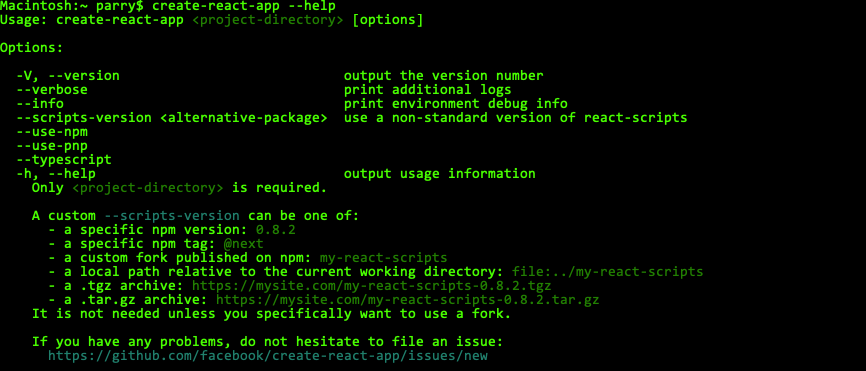
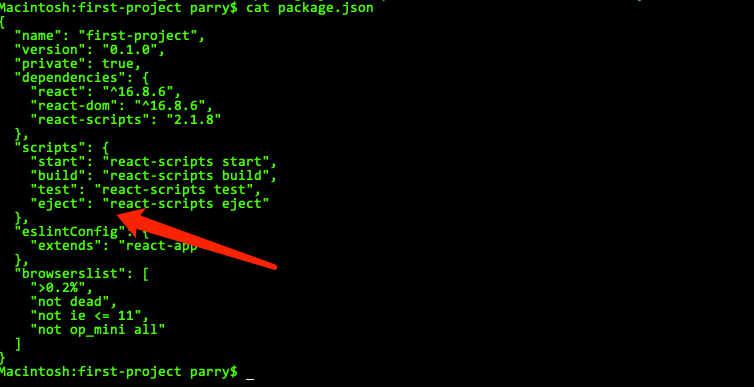

# 创建一个react应用

``` bash
npm install -g create-react-app
```




创建应用 如果不喜欢typescript 可以不进行选择
创建完成之后我们进入到目录运行
``` bash
react-create-app first-project --typescript
cd first-project
```

查看工具命令可以通过查看package.json文件中的script



导出配置文件有利于后续对项目的整合

``` bash
git init
git add .
git commit -m "init eject config"
npm run eject
```

运行开发模式
``` bash
npm run start
```

